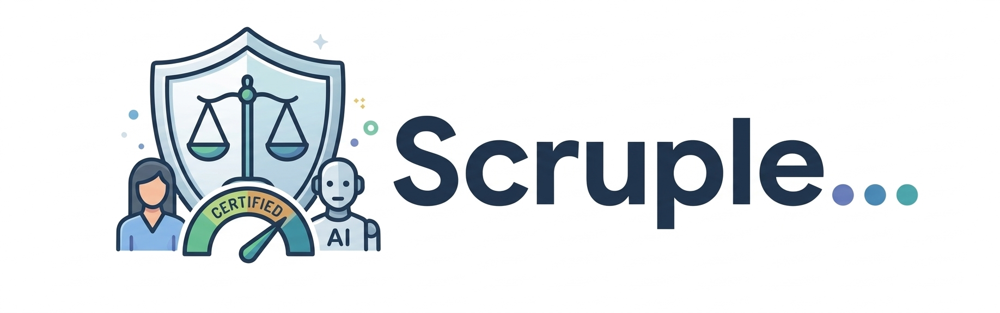

<div align="center">



<h3>Hand-code 16% of your corpus. Defend all of it.</h3>

<p>
  <b>Qualitative coding that codes what it's sure of, refuses the rest, and proves both.</b><br>
  For researchers who need a κ they can put in a paper, not a number they have to apologise for.<br>
  <sub>16% is the worked example in this repository. The benchmark against published corpora has not been run yet.</sub>
</p>

<p>
  <a href="https://github.com/samugit83/scruple/actions/workflows/ci.yml"></a>
  <a href="CHANGELOG.md"></a>
  
  <a href="LICENSE"></a>
  <br>
  <a href=".github/workflows/ci.yml"></a>
  <a href="docs/methodology.md"></a>
  <a href="docs/privacy.md"></a>
  
</p>

<p>
  <a href="#your-first-real-run"><b>Get started</b></a> ·
  <a href="#the-gap">The evidence</a> ·
  <a href="#what-you-get">What you get</a> ·
  <a href="docs/methodology.md">Methodology</a> ·
  <a href="docs/privacy.md">Privacy</a> ·
  <a href="#honest-limitations">Limitations</a>
</p>

</div>

---

## The problem

Hand-coding a corpus against a codebook takes months, and a defensible result
needs two coders doing it independently. Pointing a general-purpose LLM at the
problem lands around **κ = 0.57** against a **κ ≥ 0.70** publication bar, so
the output is not defensible, and the field has said so in print.

## The idea

Overall accuracy is the wrong target. A coder that is 57%-reliable overall is
not uniformly 57%-reliable: it is near-perfect on obvious items and poor on
ambiguous ones. Accuracy **on the subset you can identify in advance** is the
right target, and calibrated probabilities are what let you identify it.

So scruple codes the part it can defend, refuses the rest, and reports the
reliability of what it hands back, measured against blind human coding, on
data it never fitted to.

## The gap


*Reliability of the finished dataset against the share of a corpus a person
must code, on the worked example in this repository. Choosing which items to
hand to a person by calibrated uncertainty reaches κ = 0.99 after coding 16% of
the corpus; choosing them at random needs about 95% to get there. The gap is
the whole product.*

---

## Your first real run

The whole path on a real corpus, in order. Steps 1 to 6 take an afternoon. Step 7
is the one that costs you days, and it is the one that makes the result
defensible. To watch the pipeline run end to end first, with no API key and
nothing leaving your machine, skip to [the offline
example](#see-all-three-offline).

### 1. Install

Python 3.11 or newer. Two routes, and both leave you with the same `scruple`
command. Pick by whether you want to *use* the tool or *see inside* it.

**From PyPI.** The normal way. Nothing to clone, nothing to build.

```bash
pip install 'scruple[all]'    # or: uv add 'scruple[all]'
scruple --version
```

The `[all]` extra pulls in the labour chart (matplotlib), Parquet export
(pyarrow) and SPSS/Stata export (pyreadstat). Plain `pip install scruple` does
everything else, and tells you which extra is missing if you ask for one of
those three. For the newest code ahead of a release, install straight from the
repository without cloning it:

```bash
pip install 'git+https://github.com/samugit83/scruple'
```

**From a clone.** Choose this if you want the worked example, the test suite or
the source: the example ships with the repository, not with the package.

```bash
git clone https://github.com/samugit83/scruple && cd scruple
uv sync --all-extras
uv run scruple --version
```

`uv sync` builds a `.venv` from the pinned `uv.lock`, so you get exactly the
dependency versions CI tests against. Commands then run as `uv run scruple …`
and nothing is installed system-wide. Without uv, the same thing in plain
Python:

```bash
python -m venv .venv && source .venv/bin/activate
pip install -e '.[all]'       # -e: your edits take effect immediately
scruple --version
```

The steps below write `scruple`. If you took the uv route, write
`uv run scruple` instead. Everything else is identical.

### 2. Create the project

```bash
mkdir vaccine-study && cd vaccine-study
scruple init
```

| | |
|---|---|
| `scruple.yml` | every setting, commented: split seed, backend, budget, α and δ |
| `codebook.yml` | a one-code template to replace |
| `.scruple/` | project state: the frozen split, your gold judgements, the cache |
| `data/`, `out/` | where the corpus goes, and where exports land |

### 3. Point it at a model

Get a key from [console.typesafe.ai](https://console.typesafe.ai), or use a
Vercel AI Gateway key, and write a `.env` beside `scruple.yml`:

```
JEV_API_KEY=...
```

[.env.example](.env.example) lists the rest: `JEV_BASE_URL` if you are behind a
proxy, and `JEV_MODEL` if you need to pin an exact model version, which you do
as soon as published accuracy numbers depend on it.

Add `.env` to your `.gitignore` before you commit anything. A key in git
history is a live key forever, even after you delete the file.

> **Before you send anything.** Interview and survey text is usually personal
> data. If yours is, and a hosted API has not been cleared with your ethics
> committee, set `backend.name: local` in `scruple.yml` and point it at vLLM,
> llama.cpp or Ollama instead. Nothing then leaves the machine. See
> [docs/privacy.md](docs/privacy.md).

### 4. Write the codebook

This is the intellectual work, and nothing here automates it. scruple validates
`codebook.yml` and never edits or extends it.

```yaml
version: 1
codes:
  access_barrier:
    type: noul
    definition: >
      The respondent cites a practical obstacle to attending: time, transport,
      clinic opening hours, distance or cost.
    examples_yes:
      - "the clinic closes at five and I work two jobs"
      - "there is no bus out here and I do not drive"
    examples_no:
      - "I just do not think it is necessary"
  procrastination:
    type: noul
    definition: >
      The respondent intended to attend but had not yet got round to it.
    examples_yes:
      - "I keep meaning to book it and forgetting"
    examples_no:
      - "I decided against it deliberately"
```

Write each definition so that someone else could apply it to an ambiguous
answer and reach the same verdict you would. A vague definition does not fail
quietly here. It comes back in step 8 as `NOT_AUTOMATABLE`, with the
agreement between your own two coders attached to explain why.

```bash
scruple codebook check
```

```
2 codes, codebook hash dfa429118e34d976
  access_barrier               d22059a577b2  noul
  procrastination              496a67239ca9  noul
```

Those hashes are provenance. Change a definition and its hash changes, which is
how `run` later knows your calibration no longer applies to it.

### 5. Load your corpus

One row per item, a column of text, and ideally a stable id column. Without
one, ids like `row_0001` are generated for you. `.csv`, `.tsv`, `.jsonl`, or a
folder of `.txt`/`.md` files.

```bash
scruple load responses.csv --text-col response --id-col respondent_id
```

```
loaded 1,200 items from responses.csv
length (characters): median 73, p95 129, max 217
split frozen (seed 42): dev 120, calibration 540, test 540
```

The split is frozen here, before you have seen any output, and recorded with
its seed:

- **dev** (10%): the only split `try` may draw from, so iterating cannot
  contaminate the result
- **calibration** (45%): fits the thresholds
- **test** (45%): produces every number you report

### 6. Iterate cheaply, on dev only

```bash
scruple try --n 50
```

Fifty random dev items, so you can see where the model's reading of a
definition differs from yours, sharpen the wording, and run it again. Do this
now: once you have hand-coded a gold sample against a definition, changing that
definition throws the calibration away.

### 7. Hand-code a blind sample

The expensive step, and the one everything downstream rests on.

```bash
scruple gold --n 600                         # you
scruple gold --overlap 150 --coder coder_2   # a second coder, same 150 items
```

`gold` shows one item and one definition at a time and takes `y`, `n`, `?` to
skip, `b` to go back, `q` to stop. It never shows you model output, and it
records that it did not. The sample is drawn at random from a recorded seed and
you cannot choose the items, because a hand-picked sample breaks the guarantee
silently. Stop whenever you like; re-running resumes where you left off.

The overlap is not a nicety. Those 150 double-coded items give the human-human
ceiling, and without it there is no way to tell *the model is bad at this code*
from *this code is vague*.

Budget roughly 2 hours per 300 short survey answers, nearer 30 for interview
passages, and double that for the second coder.

### 8. The decision point

```bash
scruple check
```

Fits thresholds on calibration, reports on test, and gives each code a verdict:

| verdict | meaning | what to do |
|---|---|---|
| `ok` | held-out κ ≥ 0.75 | automate it |
| `weak` | κ between 0.70 and 0.75 | usable, but report it as such |
| `NOT_AUTOMATABLE` | κ below the 0.70 publication bar | hand-code it, and read the warning, because if your two coders also disagreed, the definition is what needs fixing |
| `INSUFFICIENT_EVIDENCE` | too few positives to certify either way | more gold, enriched for that code: `scruple gold --enrich <code_id>` |

`--alpha` sets the target per-class error rate (default 0.10) and `--delta` the
confidence (default 0.05). Tightening α to 0.05 roughly quadruples the gold
sample you need, and `check` reports the shortfall in items.

### 9. Code the corpus

```bash
scruple run
```

Above `engine.budget_usd` in `scruple.yml` it quotes the projected cost and
asks first; `--yes` approves in advance. It refuses outright if the codebook or
the chunking changed since calibration. That is what the hashes are for.
Uncertified codes stay yours to code by hand throughout.

### 10. Hand-code only what it refused

```bash
scruple review              # or: scruple review --limit 50
```

The abstained items, hardest last. This is the 16% on the chart at the top of
this page.

### 11. Export

```bash
scruple export              # --format csv | parquet | stata | spss
```

Three files in `out/`, described next. The third one is the product.

---

## What you get

Three files. Every competitor produces the first.

**`coded.csv`** gives your original columns, plus three per code: the decision,
the probability, and where it came from.

```csv
respondent_id,age_band,response,access_barrier,access_barrier_p,access_barrier_src
R0002,65+,The booking line was engaged every time I rang!,1,0.998,auto
R0419,40-64,"To be fair, just have not got round to it yet.",,0.41,abstain_unreviewed
R0001,65+,"It is on my list, honestly it is...",0,0.0005,human
```

**`abstentions.csv`** holds the items it refused to code, with their
probabilities, hardest cases last. Nobody else produces this.

```csv
item_id,code_id,probability,text
R0948,access_barrier,0.59,"To be fair, the booking line was engaged every time I rang, it is complicated."
```

**`validation_report.md`** carries agreement statistics against held-out human
coding, the fitted thresholds, the guarantee and its exact scope, full
provenance down to per-code hashes and the split seed, and a paragraph ready to
paste into a methods section. **This is the actual product.**

### See all three, offline

No API key, no network. The example ships a synthetic corpus and recorded
probabilities, so the whole pipeline runs offline.

```bash
git clone https://github.com/samugit83/scruple && cd scruple
uv sync
cd examples/vaccine_survey

uv run scruple codebook check     # validate the codes
uv run scruple check              # fit thresholds, report on held-out data
uv run scruple run --yes          # code the corpus
uv run scruple export             # write the three output files
```

`scruple check` on that example prints:

```
code                 kappa (held-out)  auto-code  needs you  verdict
access_barrier                   0.98      95.7%       4.3%  ok
distrust_pharma                    --         --         --  NOT_AUTOMATABLE
no_recommendation                0.99      86.7%      13.3%  ok
procrastination                  0.93      98.0%       2.0%  ok
religious_objection                --         --         --  INSUFFICIENT_EVIDENCE (7 positives)
dignity_violation                  --         --         --  NOT_AUTOMATABLE
──────────────────────────────────────────────────────────────────────────
3 of 6 codes usable · 13.3% of items abstained on those · 3 code(s) to code by hand throughout
guarantee: class-conditional error <= 10% per class, confidence 95%, per code

  dignity_violation could not be automated. Your two coders agreed only at
  kappa=0.28 on this code, which suggests the definition is underspecified.
  Consider rewriting it.
```

Those are real numbers from a real model. **Half the codes failed**, in three
different ways, and the table says which and why. A code two humans cannot
agree on is a codebook problem, not a model problem, and being told so is worth
more than a number.

---

## Honest limitations

Read these before deciding whether this fits your study.

- **Deductive coding only.** scruple applies the codebook you wrote. It will
  not discover your categories, and it is not trying to.
- **Some codes will be rejected, and that is the tool working.** In the example
  above, three of six were. One was too rare to have enough evidence, one was
  too error-prone to certify, and one was interpretive enough that the two human
  coders agreed only at κ = 0.28.
- **The guarantee covers the model-decided subset only.** Not items routed to
  you, and not codes that were never certified. The report states this rather
  than letting you assume otherwise.
- **It assumes your gold sample is random**, with known inclusion
  probabilities. A hand-picked sample breaks it silently, so `scruple gold`
  samples with a recorded seed and refuses to let you pick.
- **Gold coding is real work.** Roughly 2 hours for 300 short survey answers,
  closer to 30 for interview passages, and double that with a second coder.
  Certification is limited by the smaller class of each code, so rare codes need
  more of it, and `scruple check` tells you how many more items, in items.
- **Below about 200 gold items**, the confidence intervals are too wide to
  support strong claims whatever the point estimates say.
- **The automated coder is a coder, not ground truth.** Report it as a coder.

---

## Privacy

| backend | what is transmitted | where |
|---|---|---|
| `jev` | Full item text and your code definitions | The configured System One endpoint |
| `openai` / `anthropic` | Full item text and your code definitions | The vendor's API |
| `local` | Full item text and your code definitions | **Only** the endpoint you configure |
| `recorded` | Nothing | Nothing leaves your machine |

**If your corpus is personal data and you have not cleared a hosted API with
your ethics committee, use `local`.** It speaks the OpenAI-compatible chat API,
so vLLM, llama.cpp and Ollama all work. This is not a footnote: sending
interview transcripts to a single-region third-party API will not clear many
European university ethics committees, and a tool those researchers cannot use
does not help them.

The cache stores hashes only, never text, so `scruple purge --gold` destroys
the personal data while leaving the expensive model work intact. Details in
[docs/privacy.md](docs/privacy.md), including the threat model for untrusted
corpus text.

---

## Methodology

The statistics are the product. [docs/methodology.md](docs/methodology.md)
describes them for a methodologist reading sceptically: the three-way split,
the class-conditional risk control and why a marginal one is degenerate, the
arithmetic for how much gold coding you need, why selective κ is a diagnostic
rather than the headline, and a section on exactly what the guarantee does not
cover.

The layer is verified rather than asserted: 100% line and branch coverage
enforced in CI, κ and α implemented independently from their own definitions so
their agreement is a real cross-check, and the guarantee itself validated by
simulation: thresholds fitted on one sample, realised error measured on a
fresh one, 1,000 trials per prevalence down to 2%.

```bash
uv run pytest tests/statistical -q    # the guarantee, by simulation
```

Each run emits a paragraph like this, which you edit rather than paste blind:

> Open-ended responses (n = 1,200) were coded deductively against an
> author-written codebook of 6 binary codes using scruple 0.1.0, with jev
> providing calibrated probabilities. A random sample of 600 responses was
> hand-coded blind, without sight of model output, and partitioned into
> disjoint calibration and test sets fixed in advance (seed 42). Per-code
> decision thresholds were selected on the calibration set so that the
> class-conditional error rate, computed separately within each true class, was
> at most 10% with 95% confidence […]

---

## Comparison

| | NVivo / MAXQDA / ATLAS.ti | LLM coding scripts | scruple |
|---|---|---|---|
| Codebook management, memoing, project organisation | **Far better.** Years of work you should not rebuild | No | No |
| Theme discovery, inductive analysis | **Yes** | Yes | **No**, out of scope by design |
| Multimedia, team collaboration, visualisation | **Yes** | No | No |
| Codes a full corpus quickly | Partially | **Yes** | Yes |
| Refuses items it cannot code reliably | No | No | **Yes** |
| Reports reliability against blind human coding | Computes κ if you supply both codings | Rarely | **Yes, always** |
| A guarantee with a stated scope and assumption | No | No | **Yes** |

scruple is not a replacement for a QDA package. It is the validation step those
tools do not have, and it is deliberately narrow: it does one thing, and it
tells you when it cannot do it.

---

## Citation

```bibtex
@software{scruple,
  title  = {scruple: calibrated deductive coding with abstention and a
            class-conditional reliability guarantee},
  year   = {2026},
  url    = {https://github.com/samugit83/scruple},
  license = {MIT}
}
```

Machine-readable metadata is in [CITATION.cff](CITATION.cff). If you use this
in published work, please cite it, and please report what it refused, not only
what it coded.

---

## Status

Early. The statistics layer and the CLI are complete and tested; the R package
and the ordinal and categorical code types are not yet built. The benchmark
that the design's kill criterion rests on has not been run against published
qualitative-coding corpora, so the headline claim above is demonstrated on a
synthetic corpus with a real model, not yet on the literature's datasets.

Licence: MIT. Contributing: [CONTRIBUTING.md](CONTRIBUTING.md).
