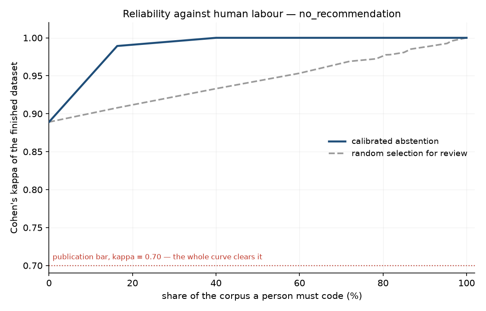

# scruple

**Qualitative coding that codes what it's sure of, refuses the rest, and proves both.**



*Reliability of the finished dataset against the share of a corpus a person
must code, on the worked example in this repository. Choosing which items to
hand to a person by calibrated uncertainty reaches κ = 0.99 after coding 16% of
the corpus; choosing them at random needs about 95% to get there. The gap is
the whole product.*

---

## The problem

Hand-coding a corpus against a codebook takes months, and a defensible result
needs two coders doing it independently. Pointing a general-purpose LLM at the
problem lands around **κ = 0.57** against a **κ ≥ 0.70** publication bar, so
the output is not defensible — and the field has said so in print.

## The idea

Overall accuracy is the wrong target. A coder that is 57%-reliable overall is
not uniformly 57%-reliable: it is near-perfect on obvious items and poor on
ambiguous ones. Accuracy **on the subset you can identify in advance** is the
right target, and calibrated probabilities are what let you identify it.

So scruple codes the part it can defend, refuses the rest, and reports the
reliability of what it hands back — measured against blind human coding, on
data it never fitted to.

---

## Quickstart

No API key, no network. The example ships a synthetic corpus and recorded
probabilities, so the whole pipeline runs offline.

```bash
git clone https://github.com/scruple-tool/scruple && cd scruple
uv sync
cd examples/vaccine_survey

uv run scruple codebook check     # validate the codes
uv run scruple check              # fit thresholds, report on held-out data
uv run scruple run --yes          # code the corpus
uv run scruple export             # write the three output files
```

`scruple check` on that example prints:

```
code                 kappa (held-out)  auto-code  needs you  verdict
access_barrier                   0.98      95.7%       4.3%  ok
distrust_pharma                    --         --         --  NOT_AUTOMATABLE
no_recommendation                0.99      86.7%      13.3%  ok
procrastination                  0.93      98.0%       2.0%  ok
religious_objection                --         --         --  INSUFFICIENT_EVIDENCE (7 positives)
dignity_violation                  --         --         --  NOT_AUTOMATABLE
──────────────────────────────────────────────────────────────────────────
3 of 6 codes usable · 13.3% of items abstained on those · 3 code(s) to code by hand throughout
guarantee: class-conditional error <= 10% per class, confidence 95%, per code

  dignity_violation could not be automated. Your two coders agreed only at
  kappa=0.28 on this code, which suggests the definition is underspecified.
  Consider rewriting it.
```

Those are real numbers from a real model. **Half the codes failed**, in three
different ways, and the table says which and why. A code two humans cannot
agree on is a codebook problem, not a model problem, and being told so is worth
more than a number.

On your own corpus:

```bash
scruple init
# write your codes in codebook.yml
scruple load responses.csv --text-col response --id-col respondent_id
scruple gold --n 600          # hand-code a blind random sample
scruple gold --overlap 150 --coder coder_2
scruple check                 # the decision point
scruple run
scruple review                # hand-code only the abstained items
scruple export
```

---

## What you get

Three files. Every competitor produces the first.

**`coded.csv`** — your original columns, plus three per code: the decision, the
probability, and where it came from.

```csv
respondent_id,age_band,response,access_barrier,access_barrier_p,access_barrier_src
R0002,65+,The booking line was engaged every time I rang!,1,0.998,auto
R0419,40-64,"To be fair, just have not got round to it yet.",,0.41,abstain_unreviewed
R0001,65+,"It is on my list, honestly it is...",0,0.0005,human
```

**`abstentions.csv`** — the items it refused to code, with their probabilities,
hardest cases last. Nobody else produces this.

```csv
item_id,code_id,probability,text
R0948,access_barrier,0.59,"To be fair, the booking line was engaged every time I rang, it is complicated."
```

**`validation_report.md`** — agreement statistics against held-out human
coding, the fitted thresholds, the guarantee and its exact scope, full
provenance down to per-code hashes and the split seed, and a paragraph ready to
paste into a methods section. **This is the actual product.**

---

## Honest limitations

Read these before deciding whether this fits your study.

- **Deductive coding only.** scruple applies the codebook you wrote. It will
  not discover your categories, and it is not trying to.
- **Some codes will be rejected, and that is the tool working.** In the example
  above, three of six were. One was too rare to have enough evidence, one was
  too error-prone to certify, and one was interpretive enough that the two human
  coders agreed only at κ = 0.28.
- **The guarantee covers the model-decided subset only.** Not items routed to
  you, and not codes that were never certified. The report states this rather
  than letting you assume otherwise.
- **It assumes your gold sample is random**, with known inclusion
  probabilities. A hand-picked sample breaks it silently, so `scruple gold`
  samples with a recorded seed and refuses to let you pick.
- **Gold coding is real work.** Roughly 2 hours for 300 short survey answers,
  closer to 30 for interview passages, and double that with a second coder.
  Certification is limited by the smaller class of each code, so rare codes need
  more of it — `scruple check` tells you how many more items, in items.
- **Below about 200 gold items**, the confidence intervals are too wide to
  support strong claims whatever the point estimates say.
- **The automated coder is a coder, not ground truth.** Report it as a coder.

---

## Privacy

| backend | what is transmitted | where |
|---|---|---|
| `jev` | Full item text and your code definitions | The configured System One endpoint |
| `openai` / `anthropic` | Full item text and your code definitions | The vendor's API |
| `local` | Full item text and your code definitions | **Only** the endpoint you configure |
| `recorded` | Nothing | Nothing leaves your machine |

**If your corpus is personal data and you have not cleared a hosted API with
your ethics committee, use `local`.** It speaks the OpenAI-compatible chat API,
so vLLM, llama.cpp and Ollama all work. This is not a footnote: sending
interview transcripts to a single-region third-party API will not clear many
European university ethics committees, and a tool those researchers cannot use
does not help them.

The cache stores hashes only, never text, so `scruple purge --gold` destroys
the personal data while leaving the expensive model work intact. Details in
[docs/privacy.md](docs/privacy.md), including the threat model for untrusted
corpus text.

---

## Methodology

The statistics are the product. [docs/methodology.md](docs/methodology.md)
describes them for a methodologist reading sceptically: the three-way split,
the class-conditional risk control and why a marginal one is degenerate, the
arithmetic for how much gold coding you need, why selective κ is a diagnostic
rather than the headline, and a section on exactly what the guarantee does not
cover.

The layer is verified rather than asserted: 100% line and branch coverage
enforced in CI, κ and α implemented independently from their own definitions so
their agreement is a real cross-check, and the guarantee itself validated by
simulation — thresholds fitted on one sample, realised error measured on a
fresh one, 1,000 trials per prevalence down to 2%.

```bash
uv run pytest tests/statistical -q    # the guarantee, by simulation
```

Each run emits a paragraph like this, which you edit rather than paste blind:

> Open-ended responses (n = 1,200) were coded deductively against an
> author-written codebook of 6 binary codes using scruple 0.1.0, with jev
> providing calibrated probabilities. A random sample of 600 responses was
> hand-coded blind, without sight of model output, and partitioned into
> disjoint calibration and test sets fixed in advance (seed 42). Per-code
> decision thresholds were selected on the calibration set so that the
> class-conditional error rate, computed separately within each true class, was
> at most 10% with 95% confidence […]

---

## Comparison

| | NVivo / MAXQDA / ATLAS.ti | LLM coding scripts | scruple |
|---|---|---|---|
| Codebook management, memoing, project organisation | **Far better.** Years of work you should not rebuild | No | No |
| Theme discovery, inductive analysis | **Yes** | Yes | **No** — out of scope by design |
| Multimedia, team collaboration, visualisation | **Yes** | No | No |
| Codes a full corpus quickly | Partially | **Yes** | Yes |
| Refuses items it cannot code reliably | No | No | **Yes** |
| Reports reliability against blind human coding | Computes κ if you supply both codings | Rarely | **Yes, always** |
| A guarantee with a stated scope and assumption | No | No | **Yes** |

scruple is not a replacement for a QDA package. It is the validation step those
tools do not have, and it is deliberately narrow: it does one thing, and it
tells you when it cannot do it.

---

## Installing

Python 3.11 or newer.

```bash
pip install scruple          # or: uv add scruple
pip install 'scruple[all]'   # charts, parquet and SPSS export
```

For the hosted backend, set your key in the environment or a `.env` beside
`scruple.yml` (see [.env.example](.env.example)):

```
JEV_API_KEY=...
```

---

## Citation

```bibtex
@software{scruple,
  title  = {scruple: calibrated deductive coding with abstention and a
            class-conditional reliability guarantee},
  year   = {2026},
  url    = {https://github.com/scruple-tool/scruple},
  license = {MIT}
}
```

Machine-readable metadata is in [CITATION.cff](CITATION.cff). If you use this
in published work, please cite it — and please report what it refused, not only
what it coded.

---

## Status

Early. The statistics layer and the CLI are complete and tested; the R package
and the ordinal and categorical code types are not yet built. The benchmark
that the design's kill criterion rests on has not been run against published
qualitative-coding corpora, so the headline claim above is demonstrated on a
synthetic corpus with a real model, not yet on the literature's datasets.

Licence: MIT.
